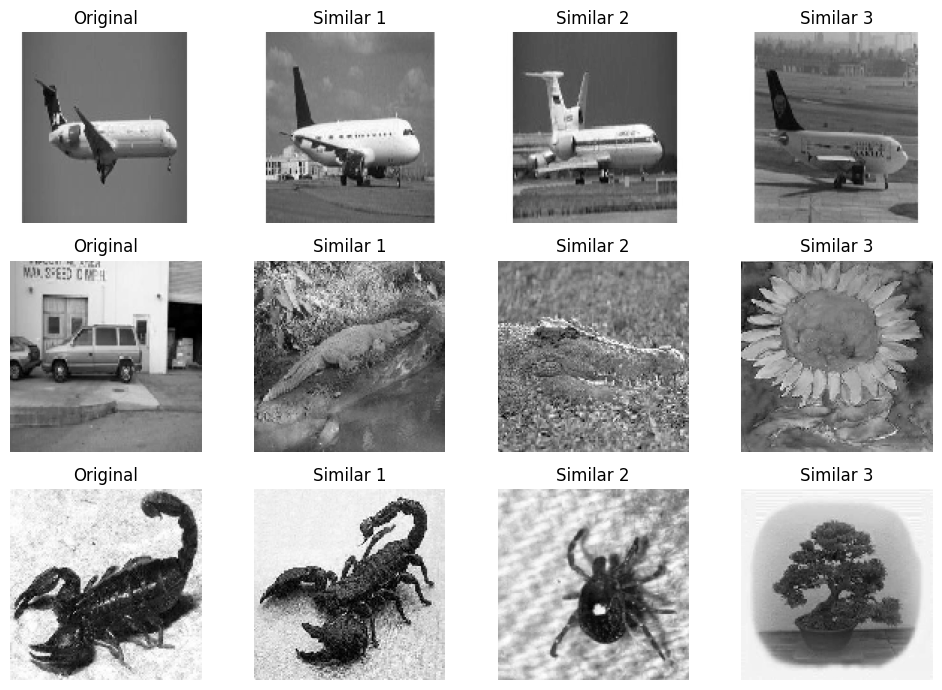

# **Google Lens Alternative: Image Similarity Search**

## **Project Overview**
This project explores multiple approaches to implement an image similarity search engine, providing a viable alternative to Google Lens. The similarity search is tested using the Caltech-101 dataset, leveraging deep learning techniques and pre-trained models to extract image features for comparison.

---

## **Objectives**
1. Develop 4-5 distinct methods for performing similarity search (e.g., autoencoders, CNN-based, and Transformer-based approaches).
2. Fine-tune and evaluate each method using metrics like recall and F1-score.
3. Compare computational efficiency and scalability for real-time applications.

---

## **Methods**
The following methods were implemented for feature extraction:
1. **Autoencoders**: Extract compressed latent representations using unsupervised learning.
2. **ResNet**: Utilize pre-trained ResNet50 to extract deep features.
3. **VGG16**: Extract features using a pre-trained VGG16 model.
4. **MobileNet**: Leverage MobileNet for lightweight feature extraction.
5. **ViT (Vision Transformers)**: Apply transformer-based features for similarity search.
6. **CLIP**: Use OpenAI’s CLIP model to extract semantic image features.

---

## **Dataset**
- **Source**: [Caltech-101](https://data.caltech.edu/records/mzrjq-6wc02/files/caltech-101.zip)
- **Preprocessing**:
  - Dataset is split into training, validation, and test sets.
  - Images are resized to a consistent dimension for compatibility with models.

---

## **Feature Extraction**
Feature extraction methods generate vector representations of images:
- **Autoencoders**: Latent vectors 
- **ResNet50**: Global Average Pooling 
- **VGG16**: Fully connected layer outputs 
- **MobileNet**: EfficientNet embeddings 
- **ViT**: Transformer embeddings 
- **CLIP**: Text-image similarity embeddings 

---

## **Evaluation**
Evaluation was performed using **Top-K Neighbors** (K=5) with the following metrics:
- **Recall**: Proportion of relevant images retrieved in the top-K results.
- **F1-Score**: Balance between precision and recall.
- **Average True Predictions in Top-K**: Average number of correctly identified images in the top-5 results.

### Results:
| **Model**      | **Recall@5** | **F1-Score** | **Avg. True Predictions in Top-5** |
|-----------------|--------------|--------------|------------------------------------|
| Autoencoder     | 0.2722       | 0.4280       | 2.0285                             |
| ResNet50        | 0.2623       | 0.4157       | 1.9462                             |
| VGG16           | 0.5796       | 0.7338       | 3.1229                             |
| MobileNet       | 0.8112       | 0.8958       | 3.7892                             |
| ViT             | 0.8924       | 0.9432       | 4.3052                             |
| CLIP            | 0.8650       | 0.9276       | 4.0637                             |

---

## **Results Visualization**
Below is an example of similarity search results using the Autoencoder method:



---

## **Installation**
1. Clone the repository:
   ```bash
   git clone https://github.com/adityabucha44/SimLens.git
   ```
2. Navigate to the project directory:
   ```bash
   cd SimLens
   ```
3. Install dependencies:
   ```bash
   pip install -r requirements.txt
   ```

---

## **Usage**
1. **Dataset Preparation**:
   Ensure the dataset is downloaded and extracted in the `datasets/` folder. Adjust paths in the `main.py` if necessary.

2. **Feature Extraction**:
   Run the main script to extract features using all methods:
   ```bash
   python main.py
   ```

3. **Evaluation**:
   Evaluate models using the extracted features:
   ```bash
   python evaluate/evaluate.py
   ```

---

## **Results and Analysis**
A detailed comparison of the methods is included in the [`notebooks/analysis.ipynb`](notebooks/rev_image_search.ipynb.ipynb). Key findings:
- **CLIP** and **ViT** offer superior performance in terms of recall and F1-score.
- **MobileNet** provides a balance between speed and accuracy, making it suitable for lightweight applications.

---

## **References**
1. Radford, Alec, et al. *Learning Transferable Visual Models From Natural Language Supervision*. arXiv preprint, 2021.
2. He, Kaiming, et al. *Deep Residual Learning for Image Recognition*. CVPR, 2016.
3. Simonyan, Karen, and Andrew Zisserman. *Very Deep Convolutional Networks for Large-Scale Image Recognition*. arXiv preprint, 2014.

---

## **License**
This project is licensed under the MIT License. See [LICENSE](LICENSE) for details.

